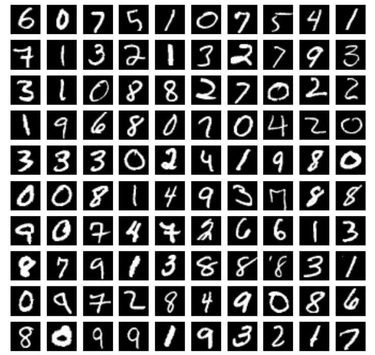
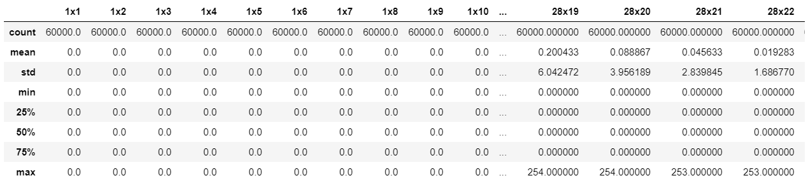
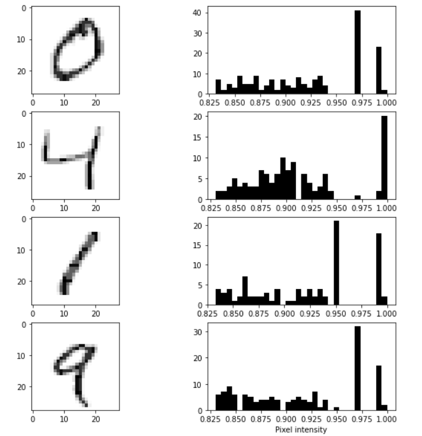
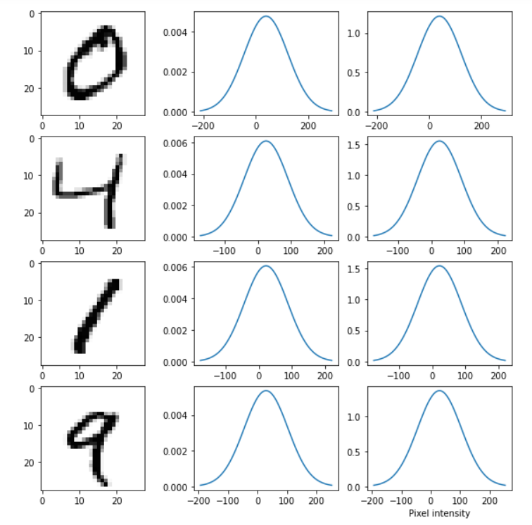
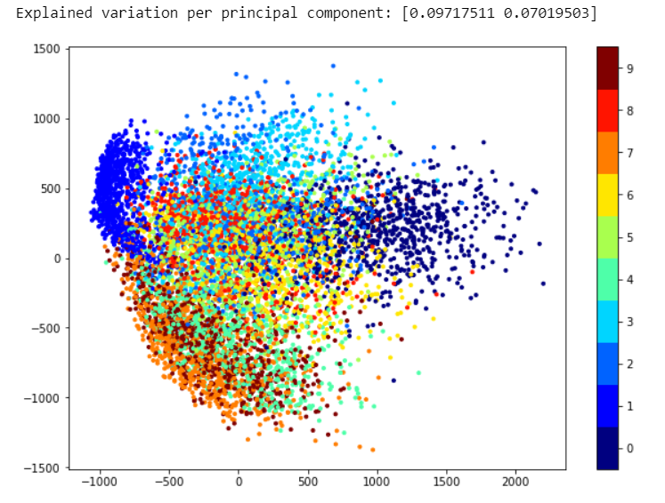
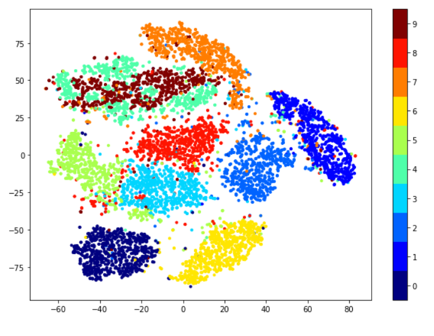

# Exploratory-Data-Analysis-of-MNIST

Download the train.csv [here](https://www.kaggle.com/oddrationale/mnist-in-csv)

We perform an exploratory analysis of the mnist handwritten digit dataset.

We examine the features of the image by calculating the mean, variance and other statistically significant jargons

We further see how the histogram plot is for each image w.r.t the pixel density

We can observe the intensity changes with different samples. Also, the intensity is not the same for samples belonging to the same class. 
We try rescaling the image and plotting the Gaussian normal distribution for unscaled and rescaled images

We have about 784 features which subsequently belong to a 784 dimensional space and is mind boggling to imagine. So, instead, we use something called as 
a Principal Component Analysis to look at the nature of clusters of our samples.

We can observe that clusters are quite packed together which indicate that there's high degree of co-relation between each feature. PCA preserves nearly all kind of co-relation and leaves us with this mess. To avoid this and have a better understanding of the data, we use another algorithm called the t-Stochastic Neighbour Embedding (t-SNE) to visualize and make sense of the data we have. 

You can find the relevant code in the [notebook](EDA%20MNIST.ipynb) linked to the repo. Feel free to explore more and create new pull requests to update the methods and add to current data exploration because I'm probably too lazy to add to this xD. 

:kissing::musical_note::v:
